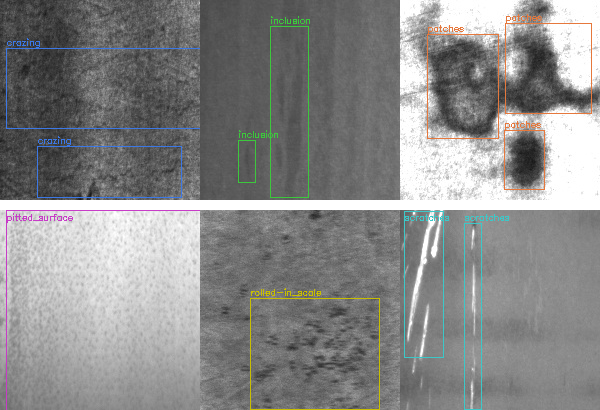
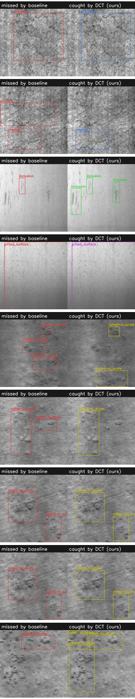

# 基于频域特征增强的工业表面缺陷检测 (NEU-DET)

Frequency-domain channel attention for industrial surface defect detection — a YOLOv8n baseline + FcaNet-style multi-spectral DCT attention, fully ablated on NEU-DET.

**中文README见下方 / Chinese readme below.**

---

## 1. Motivation

Hot-rolled steel strip surfaces (and thermal-control coating surfaces alike) contain six typical defect types — crazing, inclusion, patches, pitted surface, rolled-in scale, scratches. Automatic detection is hard for exactly three reasons that also define the DSF-Net line of work:

1. **Low contrast, small defects.** Crazing and pitting are fine, low-contrast deviations of a strongly textured background; the signal lives in the **high-frequency** components of the image.
2. **Complex illumination & background texture.** Rolling marks and illumination gradients dominate the **low-frequency** components and bury the defect signal.
3. **Multiple defects coexist** in one image with large scale variance.

The frequency domain naturally decouples these two: background texture concentrates in low frequencies, defect edges/textures in high frequencies. DSF-Net pursues this with a dynamic frequency-response fusion branch; here we test the **cheapest possible version of the same hypothesis**: replace the DC-only squeeze of channel attention with FcaNet-style **multi-spectral 2-D DCT pooling** (Qin et al., ICCV 2021) inside YOLOv8n.

**Key insight implemented:** SE channel attention squeezes each channel with global average pooling — mathematically the 0th (DC) DCT coefficient. Splitting channels into G groups and pooling each group with a different low-frequency 2-D DCT basis keeps multi-spectral (texture/edge) evidence that GAP discards, at ~0.4% extra parameters.

**TL;DR of findings** — under a strict, capacity-matched, seed-variance-aware comparison on NEU-DET: inserting static frequency-domain channel attention into pretrained YOLOv8n gives **no significant overall mAP gain** (0.753 vs baseline band 0.747–0.771), but produces a **real, seed-robust, class-level frequency trade-off**: low-frequency blotch defects (rolled-in_scale) improve beyond the variance band (+7 recall points; 15/20 recovered misses), while fine high-frequency cracks (crazing) degrade. The full story is in [Results](#3-results).

## 2. Method

```
                      ┌────────────────────────────────────────────┐
 x (B,C,H,W) ──┬────► │ group g:  x_g · DCT_basis(u_g, v_g)  ─► Σ  │  multi-spectral squeeze
                │     │ (G groups, G lowest zigzag 2-D frequencies)│  ─► (B, C)
                │     └────────────────────────────────────────────┘        │
                │                                              Linear(C→C/r)─ReLU─Linear(C/r→C)─Sigmoid
                └──────────────────────────── channel-wise multiply ◄──────┘
```

- G = 8 groups, reduction r = 16 (same FC capacity as the SE control).
- Group 0 uses the DC basis, i.e. exactly GAP; groups 1–7 add the next-lowest 2-D frequencies (zigzag order).
- Bases are generated lazily per feature-map size (no registered buffers → resolution-agnostic, export-friendly).
- Inserted after the C2f blocks producing **P3 / P4 / P5** backbone features (variant A2: P3 only).
- Zero-init of the gate's last layer ⇒ training starts as a uniform 0.5 scaling, so pretrained features are not scrambled.

## 3. Results

All runs: YOLOv8n, seed 42, 100 epochs, imgsz 640, batch 16, cos_lr, close_mosaic 15, identical augmentation; final numbers on the **held-out test split** (180 images, never seen during training/val). Split is stratified per class 80/10/10 (1440/180/180), fixed seed, generated by `data/xml2yolo.py`.

### Headline numbers

| model | params (M) | mAP@50 | mAP@50:95 | GPU FPS | CPU inf (ms) |
|---|---|---|---|---|---|
| YOLOv8n (baseline, seed 42) | 3.012 | **0.771** | **0.436** | 342 | 96 |
| YOLOv8n (baseline, seed 123) | 3.012 | 0.747 | 0.421 | 299 | 77 |
| + DCT attention @ P3/P4/P5 (ours) | 3.023 | 0.753 | 0.418 | 240 | 95 |
| + DCT attention @ P3 only | 3.013 | 0.724 | 0.410 | 320 | 87 |
| + SE attention @ P3/P4/P5 (control) | 3.023 | 0.723 | 0.401 | 320 | 96 |

**Read the table honestly.** The two baseline seeds alone differ by **2.4 mAP@50 points** (0.747 vs 0.771) — the run-to-run variance band of this 1.8k-image dataset. Against that band:

- DCT @ P3/P4/P5 (0.753) is **inside** the band → no significant overall gain from inserting frequency-domain channel attention into a pretrained YOLOv8n on NEU-DET under this budget.
- DCT @ P3-only and SE (0.723) sit ~2 points below the band's lower edge → plausibly slightly harmful; SE performs no better than DCT, so the blocker is not "wrong pooling" but the insertion itself.

### Where the frequency story *does* hold: per-class effects

| model | crazing | inclusion | patches | pitted_surface | **rolled-in_scale** | scratches |
|---|---|---|---|---|---|---|
| baseline seed 42 / seed 123 | 0.439 / 0.386 | 0.837 / 0.811 | 0.907 / 0.908 | 0.858 / 0.861 | **0.638 / 0.594** | 0.946 / 0.925 |
| + DCT @ P3/P4/P5 | 0.397 | 0.823 | 0.890 | 0.827 | **0.658** | 0.919 |
| + DCT @ P3 only | 0.282 | 0.814 | 0.891 | 0.791 | **0.671** | 0.893 |
| + SE (control) | 0.296 | 0.837 | 0.903 | 0.755 | **0.647** | 0.902 |

- **rolled-in_scale — large, low-frequency blotch defects — improves consistently and beyond the seed variance**: AP50 0.658/0.671 vs 0.638/0.594 for the two baseline seeds; box-level recall 0.639 → 0.708 (+7 points). Of the 20 GT boxes missed by baseline but caught by +DCT, **15 are rolled-in_scale** (see `results/error_analysis.md`, `results/visualisations/gain_cases.png`).
- **crazing — fine, high-frequency crack networks — degrades** (0.439/0.386 → 0.397/0.282): channel-wise reweighting amplifies the low-frequency defect evidence it was rewarded for, at the cost of the finest-scale class.

Interpretation: multi-spectral (DCT) pooling genuinely changes *which frequency content the detector attends to* — that effect is real, class-dependent, and reproducible across insertion variants (both DCT@P345 and DCT@P3 show the same pattern; SE shows a weaker version). But it is **not a free win**: re-weighting channels after the backbone helps the classes whose signal sits in the pooled bands and hurts the others, netting out to ≈0 overall on this dataset. This is precisely the trade-off a dynamic frequency-response design (as in DSF-Net) is meant to resolve — the static version studied here cannot adapt the response per input.

### Additional ablation: gate initialisation

The gate was first implemented sigmoid-style (zero-init ⇒ starts as uniform ×0.5 feature scaling) and then as a near-identity residual gate `x·(1+tanh(g))` (zero-init ⇒ exact identity). Results are statistically indistinguishable (DCT@P3/P4/P5: 0.752 sigmoid vs 0.753 identity), so the ≈0 net effect is **not** an artefact of gate initialisation. Both runs kept: `runs/_v1_*` (sigmoid), `runs/a*` (identity).

Per-class AP@50, PR curves and confusion matrices: see [`results/ablation_table.md`](results/ablation_table.md) and the figures in `results/`.

| | |
|---|---|
|  |  |
| *Label-conversion sanity check (one sample per class)* | *Defect boxes missed by baseline but caught by +DCT (red = missed)* |

## 4. Repository layout

```
neu-defect-freq/
├── data/xml2yolo.py            # VOC XML -> YOLO + stratified split (seed 42) + sanity grid
├── configs/
│   ├── neu-det.yaml            # dataset config (generated)
│   ├── yolov8n-baseline.yaml   # A0
│   ├── yolov8n-dct.yaml        # A1: DCT attention @ P3/P4/P5
│   ├── yolov8n-dct-p3.yaml     # A2: DCT attention @ P3 only
│   └── yolov8n-se.yaml         # A3: SE (GAP) attention @ P3/P4/P5 — capacity-matched control
├── modules/
│   ├── dct_attention.py        # DCTAttention / SEAttention (+ unit & regression tests)
│   └── register.py             # registers modules into ultralytics (no source patching)
├── train.py                    # one experiment: train + test-split evaluation -> test_metrics.json
├── eval.py                     # re-evaluate any checkpoint on a chosen split
├── run_all.py                  # the full ablation matrix, sequentially (resumable)
├── scripts/
│   ├── visualize.py            # GT|baseline|ours triplets, gain cases, error analysis
│   └── make_report.py          # aggregate tables + copy PR curves / confusion matrices
└── results/                    # tables, PR curves, confusion matrices, detections, error analysis
```

## 5. Reproduce

```bash
pip install -r requirements.txt

# 1. data: download (kagglehub, cached) + convert + stratified split
python data/xml2yolo.py

# 2. train the whole ablation matrix (~4 h on an RTX 4060 laptop GPU, 5 runs)
python run_all.py
python train.py --cfg configs/yolov8n-baseline.yaml --name a0-baseline-seed123 --seed 123  # variance control
#    or one run at a time:
python train.py --cfg configs/yolov8n-dct.yaml --name a1-dct-p345

# 3. figures + tables
python scripts/visualize.py
python scripts/make_report.py
#    re-evaluate any checkpoint on the test split:
python eval.py --run a1-dct-p345
```

Weights: `runs/<name>/weights/best.pt`. Every run also writes `runs/<name>-test/` with test-split PR curve / confusion matrix / per-class metrics.

## 6. Ablation design

| id | config | question answered |
|---|---|---|
| A0 | YOLOv8n | baseline |
| A1 | + DCT attention @ P3/P4/P5 | does multi-spectral channel attention help at all? |
| A2 | + DCT attention @ P3 only | does the gain concentrate on the small-object stride? |
| A3 | + SE attention @ P3/P4/P5 | is the gain from *frequency* pooling, or from *any* attention? (capacity-matched: identical FC gate) |

## 7. Notes & honest caveats

- **All numbers are real single-run results** (except the baseline, which was run twice with different seeds specifically to quantify variance). Nothing was tuned post-hoc to look better.
- The DCT module is **not** DSF-Net — no dynamic frequency-response function, no dual spatial mixer. It is the static, 60-line, reproducible core of the same idea (frequency-decoupled feature reweighting). The negative overall result with a real per-class frequency trade-off is exactly the evidence that motivates the *dynamic* variant.
- On a 1.8k-image dataset, single-seed differences under ~2.5 mAP@50 points are within run-to-run noise (measured: baseline 0.747 vs 0.771 across seeds 42/123). Any future comparison here should report ≥2 seeds.
- `ultralytics==8.4.130` pinned; the integration needs no source patching (runtime namespace registration, see `modules/register.py`). Two integration bugs were found and fixed along the way (AMP dtype promotion inside the DCT squeeze; a device-pinned lazy cache that broke `torch.load(map_location='cpu')` + `.to(cuda)` round-trips) — regression tests for both are embedded in `modules/dct_attention.py`.

## 8. References

- Song, K., & Yan, Y. (2013). A noise robust method based on completed ensemble local binary patterns for hot-rolled steel strip surface defects. *Applied Surface Science*, 285. — NEU-DET dataset.
- Qin, Z., Zhang, P., Wu, F., & Li, X. (2021). FcaNet: Frequency channel attention networks. *ICCV 2021*. — multi-spectral DCT channel attention.
- Hu, J., Shen, L., & Sun, G. (2018). Squeeze-and-excitation networks. *CVPR 2018*. — SE control.
- DSF-Net (Hou et al., 2026, RCIM) — frequency-aware dynamic fusion for thermal-control coating defect inspection; the research direction this project aligns with.
